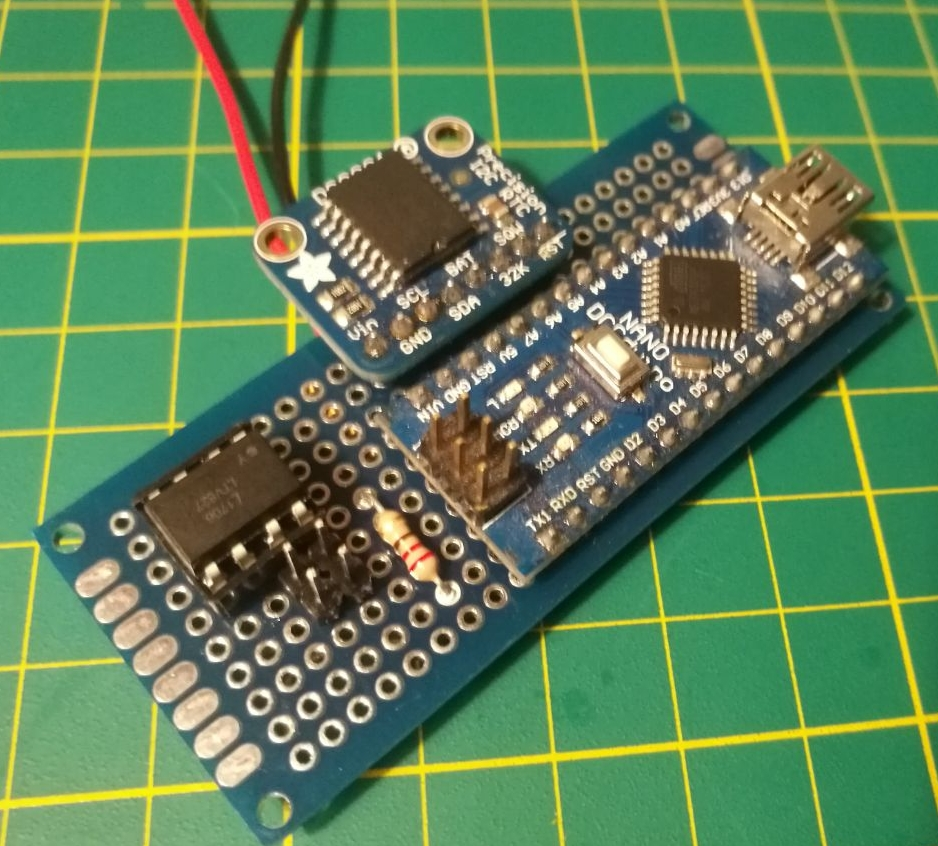
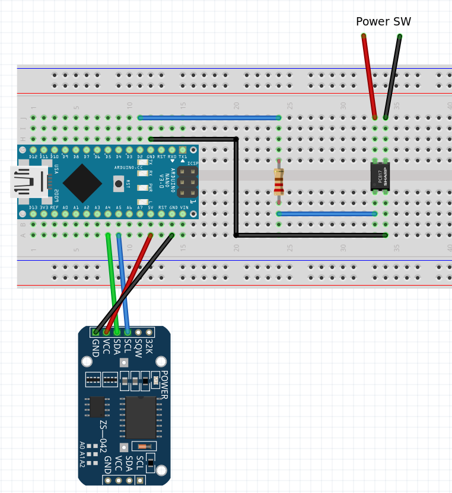
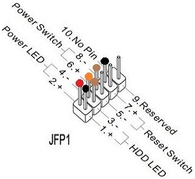

# time2boot

English version below

### Berschreibung
time2boot ist ein Arduino Projekt, was es erlaubt, einen Rechner mit Hilfe einer Echtzeituhr(RTC) zu starten.
Viele moderne Rechner bieten dieses Feature im BIOS an, leider konnte das mein Backup Rechner nicht.
Der Rechner soll um 0:00 starten, sodass automatisch Backups auf ihm erstellt werden.

### Funktion
Die Funktion ist recht simpel, der Mikrocontroller (Arduino Nano) fragt die Echtzeituhr über I²C nach der Uhrzeit.
Stimmt diese mit der einprogrammierten Zeit überein, so gibt der Mikrocontroller das Signal an einen Optokoppler, der wiederum den Ein/Aus Taster des Rechners schaltet.

#### Teile
  - Arduino Nano 
  - Adafruit DS3231 Precision RTC Breakout
  - LTV827 oder LTV817 (Optokoppler)
  - 220 Ohm Widerstand
  - Lochrasterplatine
  - Kupferlackdraht

##### Aufbau

#### Bibliotheken
Es wird die RTClib von Adafruit verwendet, diese muss in der Arduino IDE installiert werden.

#### Installation
Über die Arduino IDE wird der Sketch time2boot.ino auf den arduino Nano hochgeladen.

### Einbau
Die Platine wird dann im Rechner verbaut.
Es sollte darauf geachtet werden, dass die Pins vom Optokoppler mit der Polung der Mainboard Front Panel Pins übereinstimmen.

Zur Stromversorgung des Arduinos wird in meinem Fall ein anderer Rechner mit USB Port verwendet.
In einigen Fällen ist es möglich, vom ATX die Standby-Spannung zum betreiben des Arduinos zu benutzen, bei mir leider nicht.

---

### Description
time2boot is an Arduino project, which allows to boot a computer with the help of a real time clock (RTC).
Many modern computers offer this feature in the BIOS, unfortunately my backup computer could not.
The computer should start at 0:00, so that backups will be automatically created on it.

### Function
The function is quite simple, the microcontroller (Arduino Nano) asks the real-time clock via I²C for the time.
If this time matches with the programmed time, the microcontroller sends a signal to an optocoupler. This switches the on/off button of the computer.

#### Parts
  - Arduino Nano 
  - Adafruit DS3231 Precision RTC Breakout
  - LTV827 oder LTV817 (Optocoupler)
  - 220 Ohm Resistor
  - Prototype Board
  - Enameled copper wire

##### Construction

#### Libraries
The RTClib from Adafruit is used, this must be installed in the Arduino IDE.

#### Installation
Via the Arduino IDE the sketch time2boot.ino needs to be uploaded to the arduino Nano.

#### Montage
The board is then installed in the computer.
Make sure that the pins of the optocoupler match the polarity of the mainboard front panel pins.

To run the Arduino in my case another computer with USB port is used.
In some cases it is possible to use the standby voltage from the ATX to power the Arduino, in my case unfortunately not.